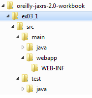

# Example Requirements and Structure


The RESTEasy distribution does not have all the software you need to run the examples. You will also need the following components:

* JDK 6.0 or later. You will, of course, need Java installed on your computer.
* Maven 3.0.4. Maven is the build system used to compile and run the examples. Later versions of Maven may work, but it is recommended that you use 3.0.4. You can download Maven from http://maven.apache.org.


### Code Directory Structure


The EXAMPLE code is organized as a set of directories, one for each exercise (see Figure 17-2). You’ll find the server source code for each example in the **src/main/java** directory. The servlet configuration for each example lives in the **src/main/webapp/WEB-INF** directory. The client code that runs the example is in **src/test/java**.





To build and run the exercises, you’ll use the Maven build tool. A product object model (POM) is provided in the *pom.xml* file at the top-level directory of each example. It contains the Maven configuration needed to compile, build, and run the specific example.


### Environment Setup


For Maven to work correctly, you will have to make sure the Maven scripts are in your path. Depending on your platform, you’ll have to execute commands like these:

* Windows:

  ```shell
  C:\> set PATH=\maven\bin;%PATH%
  ```

* Unix:

  ```shell
  $ export PATH=/home/username/maven/bin:$PATH
  ```


In each chapter, you’ll find detailed instructions on how to build, deploy, and run the exercise using Maven.
