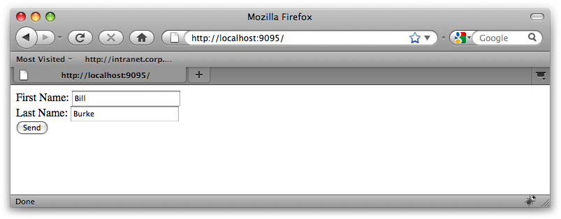
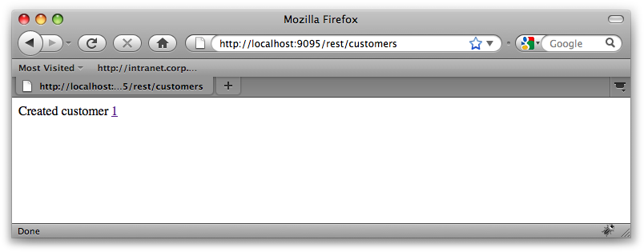
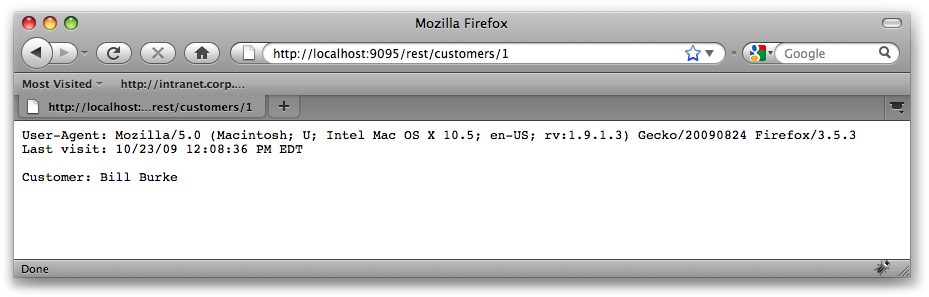

# Example ex05_2: Forms and Cookies


The *ex05_2* exercise includes examples of injecting form data, cookies, and HTTP headers using the **@FormParam**, **@CookieParam**, and **@HeaderParam** annotations. This example is a bit different than former examples, as there is no client code. Instead, to see these annotations in action, you will use a browser as your client.


### The Server Code


The example starts off with an HTML form defined in *src/main/webapp/index.html*:


```html
<html>
<body>

<form action="/rest/customers" method="post">
    First Name: <input type="text" name="firstname"/><br/>
    Last Name: <input type="text" name="lastname"/><br/>
    <INPUT type="submit" value="Send">
</form>

</body>
</html>
```


It is a simple form for creating a customer using our familiar **CustomerResource** service:


```Java:src/main/java/com/restfully/shop/CustomerResource.java
@Path("/customers")
public class CustomerResource {
...
   @POST
   @Produces("text/html")
   public Response createCustomer(
                             @FormParam("firstname") String first,
                             @FormParam("lastname") String last)
   {
```


The HTML form posts data to the **createCustomer()** method of **CustomerResource** when users click the Send button:


```Java
      Customer customer = new Customer();
      customer.setId(idCounter.incrementAndGet());
      customer.setFirstName(first);
      customer.setLastName(last);
      customerDB.put(customer.getId(), customer);
      System.out.println("Created customer " + customer.getId());
      String output = "Created customer <a href=\"customers/" +
                  customer.getId() + "\">" + customer.getId()
                            + "</a>";
      String lastVisit = DateFormat.getDateTimeInstance(
                DateFormat.SHORT, DateFormat.LONG).format(new Date());
      return Response.created(URI.create("/customers/"
                                          + customer.getId()))
                     .entity(output)
                     .cookie(new NewCookie("last-visit", lastVisit))
                     .build();

   }
```


The **createCustomer()** method does a couple things. First, it uses the form data injected with **@FormParam** to create a **Customer** object and insert it into an in-memory map. It then builds an HTML response that shows text linking to the new customer. Finally, it sets a cookie on the client by calling the **ResponseBuilder.cookie()** method. This cookie, named **last-visit**, holds the current time and date. This cookie will be used so that on subsequent requests, the server knows the last time the client accessed the website:


```Java
   @GET
   @Path("{id}")
   @Produces("text/plain")
   public Response getCustomer(
                        @PathParam("id") int id,
                          @HeaderParam("User-Agent") String userAgent,
                            @CookieParam("last-visit") String date)
   {
```


The **getCustomer()** method retrieves a **Customer** object from the in-memory map referenced by the id path parameter. The **@HeaderParam** annotation injects the value of the **User-Agent** header. This is a standard HTTP 1.1 header that denotes the type of client that made the request (Safari, Firefox, Internet Explorer, etc.). The **@CookieParam** annotation injects the value of the **last-visit** cookie that the client should be passing along with each request:


```Java
      final Customer customer = customerDB.get(id);
      if (customer == null) {
         throw new WebApplicationException(Response.Status.NOT_FOUND);
      }
      String output = "User-Agent: " + userAgent + "\r\n";
      output += "Last visit: " + date + "\r\n\r\n";
      output += "Customer: " + customer.getFirstName() + " "
                     + customer.getLastName();
      String lastVisit = DateFormat.getDateTimeInstance(
                DateFormat.SHORT, DateFormat.LONG).format(new Date());
      return Response.ok(output)
              .cookie(new NewCookie("last-visit", lastVisit))
              .build();
   }
```


The implementation of this method is very simple. It outputs the **User-Agent** header and **last-visit** cookie as plain text (**text/plain**). It also resets the **last-visit** cookie to the current time and date.


### Build and Run the Example Program


Perform the following steps:

1. Open a command prompt or shell terminal and change to the ex05_2 directory of the workbook example code. 
2. Make sure your PATH is set up to include both the JDK and Maven, as described in [Chapter 17](../chapter17/workbook_introduction.md).
3. Perform the build and run the example by typing **maven jetty:run**. This command is a bit different than our previous examples. This script builds the WAR file, but it also starts up the Jetty servlet container.


You test-drive *ex05_2* by using your browser. The first step is to go to http://localhost:8080, as shown in Figure 20-1.


When you click Send, you will see the screen shown in Figure 20-2.


Clicking the customer link will show you a plain-text representation of the customer, as shown in Figure 20-3.


If you refresh this page, you will see the timestamp of the “last visit” string increment each time as the **CustomerResource** updates the **last-visit** cookie.








