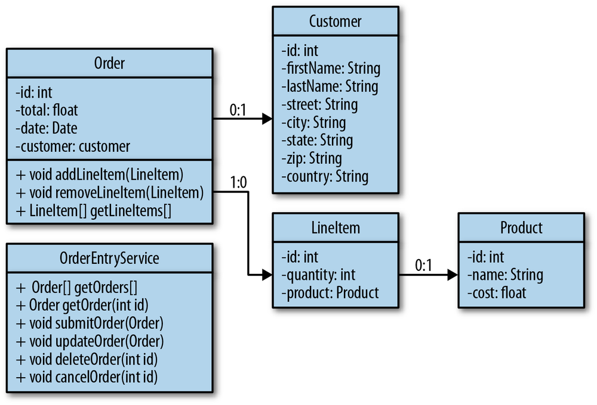

# The Object Model

The object model of our order entry system is very simple. Each order in the system represents a single transaction or purchase and is associated with a particular customer. Orders are made up of one or more line items. Line items represent the type and number of each product purchased.

Based on this description of our system, we can deduce that the objects in our model are **Order**, **Customer**, **LineItem**, and **Product**. Each data object in our model has a unique identifier, which is the integer id property. Figure 2-1 shows a UML diagram of our object model.

We will want to browse all orders as well as each individual order in our system. We will also want to submit new orders and update existing ones. Finally, we will want to have the ability to cancel and delete existing orders. The **OrderEntryService** object represents the operations we want to perform on our **Order**, **Customer**, **LineItem**, and **Product** objects.