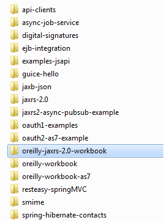

# Installing RESTEasy and the Examples

The workbook examples are embedded within the RESTEasy distribution so that as future versions of RESTEasy are released, the workbook examples will be updated along with that release. (I discovered that having a separate download for the workbook examples causes various problems—users can get confused about which package to download, and the examples can get out of sync with specific software versions.)

You can download the distribution by following the download links at http://jboss.org/resteasy.

Download the latest RESTEasy JAX-RS distribution (for example, *resteasy-jaxrs-3.0.5.Final.zip*). Figure 17-1 shows the directory structure of the distribution.

Table 17-1 describes the purpose of the various directories.

Table 17-1. RESTEasy directories

| Directory | Directory |
|:---|:---|
|docs/javadocs|Generated Javadocs for both the JAX-RS APIs and RESTEasy|
|docs/userguide|Reference guide for RESTEasy in both HTML and PDF format|
|examples|Top-level directory containing all RESTEasy examples|
|examples/oreilly-jaxrs-2.0-workbook|Contains workbook example code for each workbook chapter|
|lib|All the RESTEasy JARs and the third-party libraries they depend on|
|embedded-lib|Optional JAR files used when you are running RESTEasy in embedded mode|
|resteasy-jaxrs.war|Sample RESTEasy servlet deployment|

Don’t get confused by the other *examples/oreilly-workbook* directories. These are examples from the previous revision of this book.

For Apache Maven users, RESTEasy also has a Maven repository at http://bit.ly/HCHZm6.

The groupId for all RESTEasy artifacts is **org.jboss.resteasy**. You can view all available artifacts at http://bit.ly/1esCSDp.
