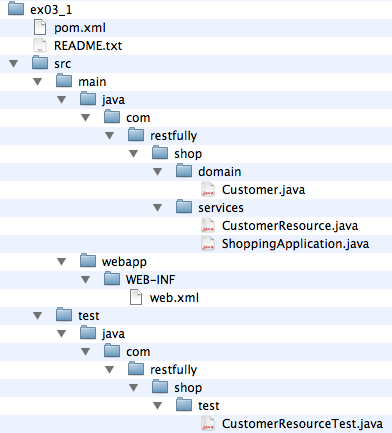

# Build and Run the Example Program


Perform the following steps:

1. Open a command prompt or shell terminal and change to the *ex03_1* directory of the workbook example code.
2. Make sure your PATH is set up to include both the JDK and Maven, as described in [Chapter 17](../chapter17/workbook_introduction.md).
3. Perform the build by typing **maven install**. Maven uses *pom.xml* to figure out how to compile, build, and run the example code.


Before we examine the build file for this example, you might want to take a quick look at the Maven utility at its [Apache website](http://maven.apache.org/).


Maven is a build-by-convention tool. It expects that your source code be laid out in a certain directory structure. From this standard directory structure, it knows how to automatically find, compile, and package your main class files. It also knows where your test code is and will compile and run it.


Every exercise in this book will follow the directory structure shown in Figure 18-1. Table 18-1 describes the purpose of the various directories.





Table 18-1. Directory structure description


| Directory |	Description |
|:---|:---|
|src|Top-level directory that contains all source and configuration files.|
|src/main|Contains all Java source code and configuration files that are used to create your package. In this case, we’re creating a WAR file.|
|src/main/java|Contains server-side Java source code.|
|src/main/webapp|Contains servlet configuration files, specifically web.xml.|
|src/test/java|Contains Java source code that will be used to run tests on the packaged archive. This code will not be included within our WAR file.|


### Deconstructing pom.xml


The *pom.xml* file provided for each workbook exercise gives the Maven utility information about how to compile and deploy your Java programs. In our case, Maven will use the information within the *pom.xml* file to compile the code within *src/main/java*, create a WAR file using the *web.xml* file within *src/main/webapp*, deploy the WAR file automatically using the Jetty-embedded servlet container, and finally, run any test code that is within the *src/test/java* directory.


Here’s a breakdown of what is contained within *pom.xml*:


```xml
<project xmlns="http://maven.apache.org/POM/4.0.0"
         xmlns:xsi="http://www.w3.org/2001/XMLSchema-instance"
         xsi:schemaLocation="http://maven.apache.org/
                        POM/4.0.0 http://maven.apache.org/maven-v4_0_0.xsd">
    <parent>
        <groupId>com.oreilly.rest.workbook</groupId>
        <artifactId>jaxrs-2.0-workbook-pom</artifactId>
        <version>1.0</version>
        <relativePath>../pom.xml</relativePath>
    </parent>
    <modelVersion>4.0.0</modelVersion>
```


In this initial part of the *pom.xml* file, we’re inheriting from a parent Maven module. This parent module defines the default configuration for Maven plug-ins as well as the location of remote Maven repositories to use to download library dependencies.


```xml
    <groupId>com.oreilly.rest.workbook</groupId>
    <artifactId>jaxrs-2.0-workbook-ex03_1</artifactId>
```


**artifactId** is the name of the project. It is also used for the name of the WAR file that is created by the build unless you override it with the **finalName** element in the build section of the POM. This artifact belongs to a family of packages defined by the element **groupId**.


```xml
    <version>2.0</version>
```


The **version** element identifies the version of the project we are creating. Generally, this version text is appended to the **artifactId** when Maven creates the WAR file, but you’ll see later that we have overridden this with the **finalName** element.


```xml
    <packaging>war</packaging>
```


The **packaging** element tells Maven that this project is building a WAR file. Other values for packaging could be **jar**, if we were creating a JAR, or **ear** for a Java EE enterprise archive.


```xml
    <dependencies>
        <dependency>
            <groupId>org.jboss.resteasy</groupId>
            <artifactId>resteasy-jaxrs</artifactId>
            <version>3.0.5.Final</version>
        </dependency>
        <dependency>
            <groupId>org.jboss.resteasy</groupId>
            <artifactId>resteasy-client</artifactId>
            <version>3.0.5.Final</version>
        </dependency>
        <dependency>
            <groupId>org.jboss.resteasy</groupId>
            <artifactId>async-http-servlet-3.0</artifactId>
            <version>3.0.5.Final</version>
        </dependency>
        <dependency>
            <groupId>org.jboss.resteasy</groupId>
            <artifactId>jaxrs-api</artifactId>
            <version>3.0.5.Final</version>
        </dependency>
        <dependency>
            <groupId>org.jboss.resteasy</groupId>
            <artifactId>resteasy-servlet-initializer</artifactId>
            <version>3.0.5.Final</version>
        </dependency>
        <dependency>
            <groupId>junit</groupId>
            <artifactId>junit</artifactId>
            <version>4.1</version>
            <scope>test</scope>
        </dependency>
    </dependencies>
```


The **dependencies** element lists all library dependencies our **ex03_1** project needs to compile and run. We are dependent on the RESTEasy project, as this is the JAX-RS implementation we are using. We are also dependent on the JUnit library for running the test code in our project. Prior to building, Maven will search for these libraries within the remote repositories listed in the parent POM. It will then download these libraries to your machine along with each of the *transitive dependencies* that these libraries have. What do I mean by transitive dependencies? Well, for example, RESTEasy depends on a multitude of third-party libraries like the servlet and JAXB APIs. The repository in which RESTEasy resides contains metadata about RESTEasy’s dependencies. Maven will discover these extra dependencies when it tries to download the RESTEasy JAR.


Unless you define a **scope** element, each dependency and its transitive dependencies will be included in your WAR’s *WEB-INF/lib* directory when it is built. Take a look specifically at the **junit** dependency:


```xml
        <dependency>
            <groupId>junit</groupId>
            <artifactId>junit</artifactId>
            <version>4.1</version>
            <scope>test</scope>
        </dependency>
```


The **junit** dependency has a **scope** of **test**. This means that this library is only used to run the tests and therefore does not need to be included within the WAR. If you were building this WAR file to be deployed on the JBoss or Wildfly application servers, you would not want to include all of these RESTEasy dependencies within the WAR file. This is because these application servers already come with JAX-RS preinstalled. In this case, you would define a **scope** of **provided** for each of the other dependencies listed in this file. For example:


```xml
        <dependency>
            <groupId>org.jboss.resteasy</groupId>
            <artifactId>resteasy-jaxrs</artifactId>
            <version>3.0.5.Final</version>
            <scope>provided</scope>
        </dependency>
```


The **provided** scope tells Maven that this is a dependency that is needed to compile your code, but that the environment in which you will deploy this WAR already includes the dependency.


OK, now that we’ve got that covered. Let’s look at the rest of our *pom.xml* file:


```xml
    <build>
       <finalName>ex03_1</finalName>
```


The **build** element contains configuration information related to how Maven should build our project. The first item we have under this section is the **finalName** element. This element overrides the default file naming conventions of Maven. Here we’re stating that we want our WAR file to be named *ex03_1.war*.


Next we have the **plugins** element. This section defines the configuration for the Maven plug-ins that will be used to build the project:


```xml
       <plugins>
            <plugin>
                <groupId>org.apache.maven.plugins</groupId>
                <artifactId>maven-compiler-plugin</artifactId>
                <configuration>
                    <source>1.6</source>
                    <target>1.6</target>
                </configuration>
            </plugin>
```


The first **plugin** listed is the compiler plug-in, which is used to configure the Java compiler. Here, the plug-in is configured to compile our source code into the Java 6 bytecode format:


```xml
            <plugin>
                <groupId>org.apache.maven.plugins</groupId>
                <artifactId>maven-surefire-plugin</artifactId>
                <configuration>
                    <skip>true</skip>
                </configuration>
                <executions>
                    <execution>
                        <id>surefire-it</id>
                        <phase>integration-test</phase>
                        <goals>
                            <goal>test</goal>
                        </goals>
                        <configuration>
                            <skip>false</skip>
                        </configuration>
                    </execution>
                </executions>
            </plugin>
```


The next plug-in we need to configure is **surefire-it**. This plug-in controls how our test execution works. By default, Maven will compile the source code under *src/main/java* and *src/test/java* and then try to run the tests under *src/test/java*. If the tests succeed, it packages the *.class* files into a WAR or JAR file. In our case, though, we want to create a WAR file and deploy it to the Jetty-embedded servlet container *before* we run our test code. The **surefire-it** configuration listed tells Maven not to run the test code until the WAR file has been built and deployed to Jetty:


```xml
            <plugin>
                <groupId>org.mortbay.jetty</groupId>
                <artifactId>jetty-maven-plugin</artifactId>
                <version>8.1.11.v20130520</version>
                <configuration>
                    <webApp>
                        <contextPath>/</contextPath>
                    </webApp>
                    <scanIntervalSeconds>10</scanIntervalSeconds>
                    <stopKey>foo</stopKey>
                    <stopPort>9999</stopPort>
                </configuration>
                <executions>
                    <execution>
                        <id>start-jetty</id>
                        <phase>pre-integration-test</phase>
                        <goals>
                            <goal>run</goal>
                        </goals>
                        <configuration>
                            <scanIntervalSeconds>0</scanIntervalSeconds>
                            <daemon>true</daemon>
                        </configuration>
                    </execution>
                    <execution>
                        <id>stop-jetty</id>
                        <phase>post-integration-test</phase>
                        <goals>
                            <goal>stop</goal>
                        </goals>
                    </execution>
                </executions>
            </plugin>
```


The final plug-in is the Jetty plug-in, which is responsible for running the Jetty-embedded servlet container. After the WAR file is built, the Jetty container will boot up an HTTP server under port 8080. The WAR file is then deployed into Jetty.


I don’t really need to explain the specifics of the entire Jetty plug-in configuration. The interesting bits that you might want to tweak are the **port** (8080) and the **stopPort** (9999). You may have to change these if there is a service on your computer already using these network ports.


### Running the Build


To run the build, simply type **mvn install** at the command prompt from the *ex03_1* directory. The output will look something like this:


```shell
[INFO] Scanning for projects...
[INFO]
[INFO] ------------------------------------------------------------------------
[INFO] Building ex03_1 2.0
[INFO] ------------------------------------------------------------------------
[INFO]
Downloading: http://download.java.net/maven/1
                  /org.jboss.resteasy/poms/resteasy-jaxrs-3.0.5.Final.pom
...
```


You’ll see Maven downloading a bunch of files from the repositories. This may take a while the first time you run the build script, as Maven needs to pull down a huge number of dependencies:


```shell
[INFO] Compiling 3 source files to C:\resteasy\p1b-repo\master\jaxrs
                      \examples\oreilly-jaxrs-2.0-workbook
                      \ex03_1\target\classes
[INFO]
[INFO]
[INFO] Compiling 1 source file to C:\resteasy\p1b-repo\master\jaxrs
                      \examples\oreilly-jaxrs-2.0-workbook
                      \ex03_1\target\test-classes
```


Next, you’ll see Maven compiling your main and test source code:


```shell
[INFO] Tests are skipped.
[INFO]
[INFO] Packaging webapp
[INFO] Assembling webapp [jaxrs-2.0-workbook-ex03_1] in
                      [C:\resteasy\p1b-repo\master\jaxrs
                      \examples\oreilly-jaxrs-2.0-workbook
                      \ex03_1\target\ex03_1]
[INFO] Processing war project
[INFO] Copying webapp resources [C:\resteasy\p1b-repo
                      \master\jaxrs
                      \examples\oreilly-jaxrs-2.0-workbook
                      \ex03_1\src\main\webapp]
[INFO] Webapp assembled in [172 msecs]
[INFO] Building war: C:\resteasy\p1b-repo\master\jaxrs
                      \examples
                      \oreilly-jaxrs-2.0-workbook
                      \ex03_1\target\ex03_1.war
```


Then you’ll see that the WAR file is built:


```shell
[INFO] Started Jetty Server
[INFO]
[INFO] Surefire report directory: C:\resteasy\p1b-repo
                                \master\jaxrs\examples
                         \oreilly-jaxrs-2.0-workbook\
                         ex03_1\target\surefire-reports

[source,java]
-------------------------------------------------------
 T E S T S
-------------------------------------------------------
Running com.restfully.shop.test.CustomerResourceTest
*** Create a new Customer ***
Created customer 1
Location: http://localhost:8080/services/customers/1
*** GET Created Customer **
<customer id="1">
   <first-name>Bill</first-name>
   <last-name>Burke</last-name>
   <street>256 Clarendon Street</street>
   <city>Boston</city>
   <state>MA</state>
   <zip>02115</zip>
   <country>USA</country>
</customer>

**** After Update ***
<customer id="1">
   <first-name>William</first-name>
   <last-name>Burke</last-name>
   <street>256 Clarendon Street</street>
   <city>Boston</city>
   <state>MA</state>
   <zip>02115</zip>
   <country>USA</country>
</customer>

Tests run: 1, Failures: 0, Errors: 0, Skipped: 0, Time elapsed: 0.487 sec

Results :

Tests run: 1, Failures: 0, Errors: 0, Skipped: 0
```


Finally, Maven will start Jetty, deploy the WAR file created, and run the test code under *src/test/java*:


```shell
[INFO]
[INFO]
[INFO] ------------------------------------------------------------------------
[INFO] BUILD SUCCESS
[INFO] ------------------------------------------------------------------------
[INFO] Total time: 4.462s
[INFO] Finished at: Mon Aug 26 12:44:11 EDT 2013
[INFO] Final Memory: 23M/618M
[INFO] ------------------------------------------------------------------------
```


The output of the build should end with **BUILD SUCCESS**.